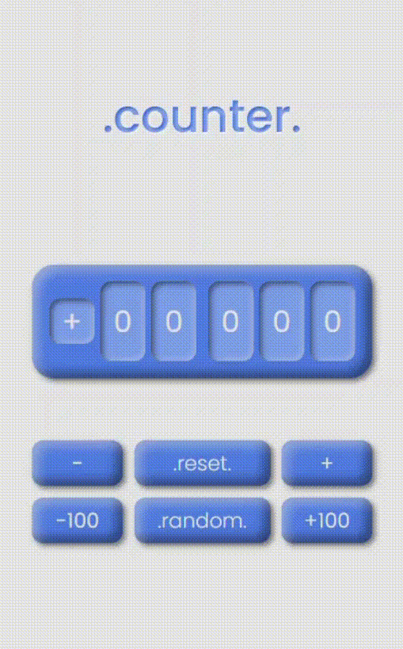
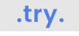

## 👀 Overview
*.counter.* is a simple JavaScript application that works as a counter. It has a container that displays a number between **-99999** and **99999**. 

The counter value can be controlled by clicking on the -/+ buttons,  which respectively decrease and increase counter's value by 1, or by clicking on the -100/+100 buttons and decrease/increase by 100.

- *.reset.* button resets the count to 0.
- *.random.* button generates a random number between -99999 and 99999.

## ⭐ Quick Link
You can easily try the application by clicking the button below:

## 📖 Features
- web application developed only with <a href="https://sass-lang.com/">Sass</a> and <a href="https://javascript.info/">JavaScript</a>
- functional and responsive design

## ⚠️ License
*.counter.* is [MIT licensed](LICENSE.md)
